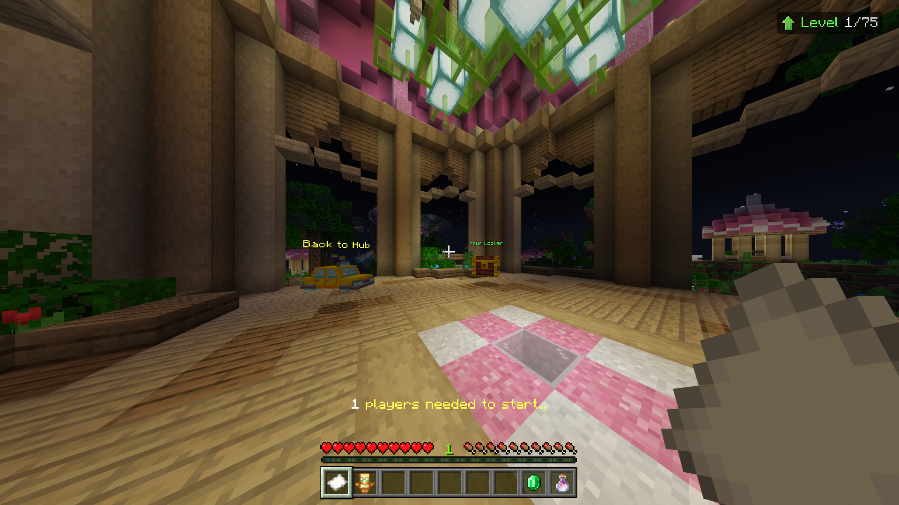

# ☀️ - citrine

> A mockup re-creation of the popular Minecraft minigame: **"SkyWars: Lucky Ores"**.
> 
> Built for Minecraft Bedrock **v1.20.60 (or higher)** using **PowerNukkitX**

## Features

- [x] Hub system
- [x] Game queueing system
- [x] Multi-map/world support
- [x] Functional NPCs and custom entities and items
- [x] Custom anti-cheat solution
- [x] Original SkyWars gameplay mechanics with implementation of "Lucky Ores"

*and more...*

## Known issues

- No randomized ore generation; *unfortunately baked into the maps*
- Buggy world transitions between hub/lobby/game
- Update transition between *v1.20.15* and *v1.20.60* caused block palette issues when adding new custom blocks, so player-held boomboxes had to disabled **(may have been fixed in newer versions of PowerNukkitX)**
- Hub NPCs not spawning correctly, usually fixed with */reload*
- Lack of party/spectating system, player statistics, Mystery Chests and kill leader statues
- Various unfinished temporary fixes: spawn borders, scoreboard, win screen, custom entities textures being picked at random, etc.

And many other underlying issues...

Note that the whole service runs under **one instance** - this means many worlds with varying players inside of them will all run at the same time which can be quite resource heavy; these worlds also get allocated and deallocated during gameplay, which can cause the server to hitch depending on the resources available.

## Notice

This short project contains some rather ugly code as the base was written in about a weeks time and was never intended to be released to the public *(now is for archival purposes)* - expect there to be a lot of uncommented, cramped and convoluted code *(especially parts like the map loading or in-game mechanics)*.

There are many parts that were written on-the-fly and deemed temporary but eventually turned to permanent.

Originally built for *v1.20.15* and updated to *v1.20.60*, and most likely supports *higher versions*.

> Use */forcestart* in a lobby for single-player sessions.

## Compiling

The project can be built like:
- Load the project folder in your IDE
- Add your target build of *PowerNukkitX*'s JAR as a library to the project
- Use a recent version of Java JDK that matches with *PowerNukkitX*'s build version - *you may get an error whilst loading the plugin if you don't do this*

The project will then be ready for compilation to *JAR*.
  
You will also need the world and resource pack prerequisites before running it on a server.

> The **releases** tab contains these prerequisites, and also an optional ready-to-host server instance for instantaneous setup.

## Image gallery

